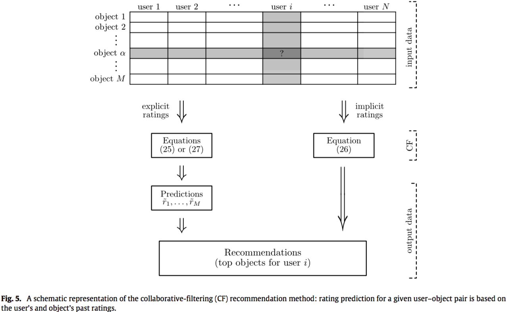
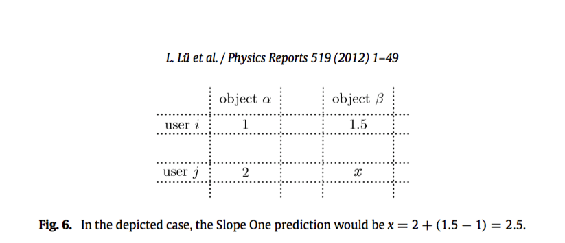
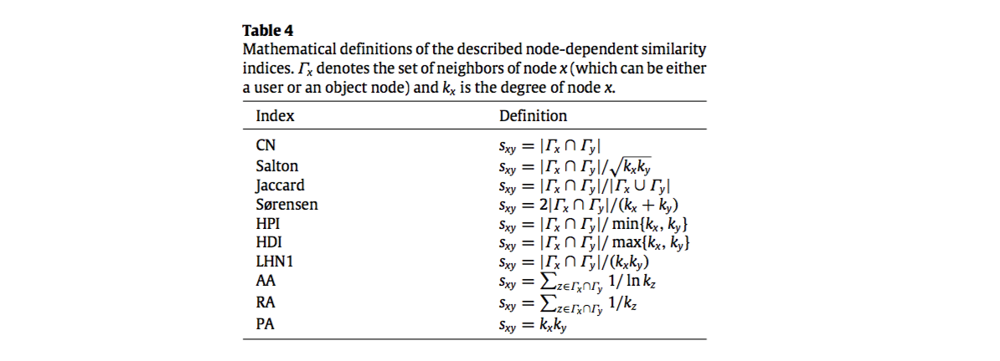

###基于相似的算法

 基于相似的推荐算法代表着推荐系统中最成功的一种，他们已经被广泛研究并在电子商务中的建立了各种应用[117,118]。这类算法可以进一步分为基于用户（user-base）和基于项目(item-base)相似度的方法。基于用户相似性的方法的基本假设是，在过去的评价一致的人在未来的评价中往往会再次一致。因此，对于目标用户，根据与目标用户相似的用户（“品味对象”）的评价来估计对象的潜在评价（参见图5作为示意图）。与用户相似度不同，基于项目相似度的算法向用户推荐与用户之前收集的对象相似的对象。请注意，有时来自不相似用户（兴趣不同）[119]或负面评价[120,121]的意见在确定推荐系统过程中可能发挥重要（甚至是积极的）作用，特别是当数据集非常稀疏时，因此关联性的信息比相似性信息更加重要[122]。有关更多信息，请参阅最近的回顾文章[123,124]，[125]是一个很好的综述，其中包含许多相似性指数。
 
 
 

####算法
 
 这里我们简要的介绍常规的基于相似度的算法即常说的基于记忆的协同过滤技术。 “协同过滤”一词由第一个商业推荐系统的创作者Tapestry [126]引入，他源于这样一个事实：它需要多个代理人协作共享他们的数据以获得更好的推荐。 在以下部分中，我们描述了基本算法以及计算相似度的主要方法，这是推荐过程的关键组成部分。 

#####用户相似度
 
 该算法的目的是通过收集其他用户尤其是那些和目标用户具有相同评价的用户的评价来自动预测目标用户的偏好。设$r_{u\alpha}$表示用户$u$对商品$\alpha$的评价，$\Gamma_u$表示用户$u$已经评价过的商品的集合。用户评价的平均值计算方式为$\bar {r_u} = \frac {1} {|\Gamma_u|} \sum_{a \in \Gamma_u} r_{u\alpha}$。根据标准的协同过滤算法，预测的用户$u$对商品$\alpha$的评价是$$\bar {r}_{u\alpha}=\bar {r}_u+K\sum_{v \in \hat{U}_u} S_{uv}(r_{v\alpha} - \bar r_v ) \quad \quad \quad  (25) $$其中$\hat{U}_u$代表与目标用户$u$高度相似的用户集合，$S_{uv}$代表用户$u$和用户$v$之间的相似度,$K = \frac {1} {\sum_v|S_{uv}|}$是一个标准化的因子。如果没有显性的评价，只知道用户收集的对象（商品）的集合（隐性评价），我们的目标则是去预测用户未来最有可能会收集的对象，根据[119]，公式25应该被替换为$$P_{u\alpha} = \sum_{v \in \hat{U}_u} S_{uv} \alpha_{v\alpha} \quad \quad \quad  (26)$$其中$P_{u\alpha}$是对用户$u$推荐商品$\alpha$的分数，$\alpha_{v\alpha} $ 是“用户-商品”二部图的邻接矩阵的元素（如果用户$u$收集过对象$\alpha$ 则 $\alpha_{v\alpha} =1$ 否则 $\alpha_{v\alpha} =0$）
 
 公式25和26已经明确说明了该算法只考虑那些和目标用户$u$相似的用户，通常有2种方法来获取$\hat U_u$ ：（i）相似系数阈值[127]通过选择相似度$s_{uv}$大于阈值的用户$v$，（ii）最大数量邻居方法[128]通过选择$k$个与用户$u$最相似的用户（$k$在这里是算法 的一个参数）。限制在只计算那些最相似的用户不仅有利于计算也能够获得更好的结果。
 

####商品相似

在该算法中，商品之间的相似度$S_{\alpha \beta}$被引进代替用户之间的相似度$S_{uv}$，最简单的办法就是通过加权平均来估计那些未知的评价[130]$$\widetilde{r}_{\alpha \beta} = \frac {\sum_{\beta \in \Gamma_u} S_{\alpha \beta} r_{u \beta}} {\sum_{\beta \in \Gamma_u} |S_{\alpha \beta}|} \quad \quad \quad  (27)$$其中$\Gamma_u$表示用户$u$评级过的对象集合，和上面的用户相似度一样，在计算$\widetilde{r}_{\alpha \beta} $的时候将对象限制为那些和对象$\alpha$最相似的的。相对于基于用户间的用户相似度方法，该算法的的好处是对象之间的相似度趋向于稳定的，允许离线计算其值和邻居 its values and neighborhoods（换言之，可以在用户请求推荐之前计算--这样可以缩短获取推荐的时间）。混合基于对象的和基于用户或基于用户属性的协同推荐算法在[131,132]中被提出来，他们的结果表明，该方法不但能够提高预测的精准性，而且对于那些稀疏的数据鲁棒性更好。

####Slope One predictor

该算法是形式为 $f(x) = x + b$ 的算法，其中$b$是常量$x$是代表打分的变量,他是最简单的基于打分的基于商品的协同过滤算法。它减掉两个商品的平均评分，以衡量一个商品在平均值上比另外一个商品喜好程度多多少。这个差别被用来预测用户对一个商品的评分当他对另外一个商品的评分已知的时候。举例来说，用户$i$ 对商品$ \alpha \beta$ 打分分别是1和2，用户 $j$ 给商品 $\alpha$ 打了2分,Slope one 就会预测用户 $j$ 对商品 $\beta$ 的打分为 $2+(1.5-1) =2.5 $(参考图6具体的说明)

Slope one 算法同时考虑了对相同商品评分的其他用户和被同一用户评分的其他商品的信息，尤其在预测的过程中只考虑和目标用户有共同商品评分的用户和目标用户已经评分过的商品。用 $S(\alpha ,\beta)$ 表示同时评价商品 $\alpha $ 和 $\beta$ 的用户集合，商品 $\beta$ 相对于商品 $\alpha$ 的平均偏差被定义为$$dev_{\beta \alpha} = \frac{\sum_{i \in S(\alpha ,\beta)} r_{i \beta} -r_{i \alpha} }{|S(\alpha ,\beta)|} \quad \quad \quad  (28)$$给定一个已知的评分$r_{u\alpha}$，slope one 预测用户 $u$ 对商品 $\beta$ 的评分为 $r_{u \alpha}+dev_{\beta \alpha}$，改变公式28中的 $\alpha$ ，我们会得到不同的预测结果，所以一个更加合理的全面的预测方法是对他们做平均。$$\bar r_{u\alpha} = \frac{1}{|R(u,\alpha)|} \sum_{\alpha \in R(u,\alpha)} (r_{u \alpha} +  dev_{\alpha \beta} ) \quad \quad \quad  (29)$$，其中 $R(u,\alpha)$ 是用户 $u$  评价的商品集合，需要注意的是无论多少用户共同参与对商品 $\alpha \beta$ 打分,算法对不同的商品 $\alpha$ 的权重是相同的。考虑到实际上 $dev_{\alpha \beta}$ 依赖于 $|S(\alpha ,\beta)|$(重合的越多，信任度越高)，我们可以得到一个加权的 slope one算法 $$ \bar r_{u\alpha}^w = \frac{ \sum_{\alpha} |S(\alpha ,\beta)|(r_{u \alpha} +  dev_{\alpha \beta} ) }{\sum_\alpha S(\alpha ,\beta)}
\quad \quad \quad  (30)$$ 基本Slope One算法的另一个改进是将所有商品集合划分为用户喜欢和不喜欢的（一个来识别喜欢和不喜欢的项目直接标准是检查他们的评分是高于还是低于给定用户的平均评分）。从这些喜欢的和不喜欢的集合导出2个单独的预测然后结合在一起来预测。用 $S^{+1}(\alpha , \beta) ,S^{-1}(\alpha , \beta)$ 分布代表用喜欢和不喜欢的集合，喜欢和不喜欢的偏差定义为 $$ dev_{\beta \alpha}^{+1} = \frac{1}{|S^{+1}(\alpha ,\beta)|}{\sum_{i \in S(\alpha ,\beta)} (r_{i \beta} -r_{i \alpha} )}   \quad \quad   dev_{\beta \alpha}^{-1} = \frac{1}{|S^{-1}(\alpha ,\beta)|}{\sum_{i \in S(\alpha ,\beta)} (r_{i \beta} -r_{i \alpha} )}  \quad  (31)$$ 基于商品$\alpha$的打分对商品$\beta$的打分预测是 $dev_{\beta \alpha}^{+1}$ 或者 $dev_{\beta \alpha}^{-1}$ 这取决于目标用户 $j$ 喜欢或者不喜欢商品$\alpha$，于是定义 Bi-Polar Slope One为 $$ p_{j\beta}^{bi} = \frac {\sum_{\alpha} |S^{+1}(\beta ,\alpha)|(r_{j\alpha}+dev^{+1}_{\\beta \alpha})+\sum_{\alpha} |S^{-1}(\beta ,\alpha)|(r_{j\alpha}+dev^{-1}_{\\beta \alpha})}   {\sum_{\alpha} |S^{+1}(\beta ,\alpha)|+\sum_{\alpha} |S^{-1}(\beta ,\alpha)|} \quad \quad \quad (32)$$ ，其中权重部分和带权重的Slope One相似。

实践表明，slope one算法能够比线性回归（即通过$f(x) = ax+b$的估计）得到更好的结果，这个简单的方法也减少了存储成本和降低推荐系统的延迟性。Slope One已被用作积木来改进其他算法[134-136]。 例如，它可以与基于用户的协同过滤组合，以通过 slope one 方案填充用户商品矩阵的空白评分来解决数据稀疏问题，从而提高预测精度[134]。

###如何定义相似

基于相似度算法的关键问题是如何定义用户或对象之间的相似性。 当显式评级可用时，通常使用诸如Pearson之类的相关指标来定义相似度（如果两个用户倾向于对他们评估的对象给出类似的评级，则认为两个用户相似）。 当没有可用的评估信息时，可以从输入数据的结构属性推断出相似性（当他们喜欢/购买了许多共同的对象时，两个用户被认为是相似的）。 此外，可以利用诸如用户属性，标签和对象的内容元信息之类的外部信息来更好地估计相似性。

####基于打分的相似

在许多在线电子商务服务中，用户可以通过打分对消费对象进行评价。 例如，在雅虎音乐中，用户用一到五颗星给每首歌曲投票，“再也不播放”$\star $，“可以”($\star \star $) ，“喜欢”($\star \star \star $) ，“爱它”($\star \star \star \star $)  和 “非常爱”($\star \star \star \star \star $)。 通过显性的评分信息，我们可以通过余弦指数[15,137]来测量两个用户之间或两个对象之间的相似度，余弦指数定义如下：$$ S_{xy}^{cos} = \frac{r_x \bullet r_y}{| r_x || r_Y|} \quad \quad \quad (33)$$计算用户之间的相似性时，$r_x，r_y$是N维商品空间中的评估向量，而当计算商品之间的相似性，$r_x，r_y$ 是M维度用户空间中的向量。 请注意，在计算基于评分的相似度时，有必要消除用户和/或商品的评级倾向，否则相似性结果没意义。 实际上，根据最近报道的智能方法，在一些评分系统中，通过适当使用评分趋势，预测未知评分的时候可以比基于相似度的简单方法准确性高得多[116]。

评分相关性也可以通过person系数来计算。通过公式$$ s_{uv}^{PC}  = \frac {\sum_{\alpha \in O_{uv}} (r_{u\alpha} - \bar r_u)(r_{v\alpha} - \bar r_v)} {  \sqrt{\sum_{\alpha \in O_{uv}} (r_{u\alpha} - \bar r_u)^2}   \sqrt{\sum_{\alpha \in O_{uv}} (r_{v\alpha} - \bar r_v)^2}   } \quad \quad \quad(34)$$来量化用户 $u$ 和 $v$ 之间的相似性，其中 $O_{uv} = \Gamma_u \cap \Gamma_v$ 表示被用户$u,v$同时评分的商品集合。由Shardanand和Maes提出的约束Pearson系数[127]用“中心”(central)评分（例如，从1到5的评分，可以将中心评分设置为3）来代替公式34中的用户平均值。 这个想法是考虑到积极（高于中心评分）和负面评分（低于中心评分）之间的差异。 加权Pearson系数是基于捕获可以放在相似度值上的置信度的想法（当两个用户只评分了几个共同的商品时，它们的潜在的高相似性不应该 和具有许多共同商品评分的一对用户可信度一样）。 [138]提出将皮尔逊系数加权为$$S_{uv}^{WPC} = \begin{cases} S_{uv}^{PC}\frac{O_{uv}}{H} &  for \space |O_{uv}| \leq H \\\\ S_{uv}^{PC} & otherwise\end{cases} \quad \quad \quad(35)$$其中H是阈值，通过实验确定，超过该阈值的相关性可信。

类似的，商品之间的person相似性溃疡定义为 $$ s_{\alpha \beta}^{PC}  = \frac {\sum_{u \in U_{\alpha \beta}} (r_{u\alpha} - \bar r_{\alpha})(r_{u\beta} - \bar r_{\beta})} {  \sqrt{\sum_{\alpha \in O_{uv}} (r_{u\alpha} - \bar r_{\alpha})^2}   \sqrt{\sum_{\alpha \in O_{uv}} (r_{u\beta} - \bar r_{\beta})^2}   } \quad \quad \quad(36)$$ 其中 $U_{\alpha \beta}$是同时给商品 $\alpha ,\beta$ 评分的用户集合， $\bar r_{\beta}$是商品 $\beta$ 评分的平均值。试验证明Pearson系数比向量的余弦指数效果更好。当只有二元评分（喜欢和不喜欢，购买了和米有购买，点击或者没有点击）的时候，余弦和pearson系数依旧可以量化二元向量的相似性。 例如，亚马逊的专利算法[117]通过计算代表用户购买情况的二元向量的余弦相似性来做基于商品的协同过滤。

####结构相似性

如上所述，可以使用诸如标签和内容信息之类的外部属性来定义相似度。然而，所需的数据通常很难收集。另一个简单而有效量化相似性的方法是结构相似性[139]，它是完全基于数据的网络结构。最近的研究表明，相对于Pearson相关系数相似性方法，基于结构的相似性可以产生更好的推荐结果，特别是当输入数据非常稀疏时[122]。

为了计算用户或者商品之间的结构相似度，我们通常将包含系统完整信息的用户商品二分网络投入到用户-用户或商品-商品网络中（有关相似性方面的更多信息，请参见[103]）。在最简单的情况下，如果两个用户至少投票一个相同商品，那么两个用户被认为是相似的（类似地，如果两个商品被至少一个用户共同投票，则被认为是相似的）。更精细的相似性度量可以粗略地分类为依赖于路径的路径，本地与全局，无参数与参数相关，等等。我们将回顾其中的一些。

（i）节点依赖相似性。最简单的加权相似性指数是相同的邻居（CN），其中两个节点的相似性由公共邻居的数量直接给出（考虑同时购买$\alpha \beta$两个商品的用户数量和/或用户u和v都购买的商品数量）。通过考虑两个目标节点的度，得出了CN的六个变体：Salton指数[140]，Jaccard指数[141]，Sørensen指数[142]，Hub推荐指数（HPI）[143]，Hub Depressed Index（HDI）和Leicht-Holme-Newman指数（LHN16）[144]。可以进一步考虑各个共同邻居的度来奖励具有较高权重的较少连接的邻居，如在Adamic-Adar指数（AA）[145]和资源分配指数（RA）[102]。注意，由于AA使用对数加权，因此对于高度共同邻居惩罚小于RA的。最后，优先连接 (PA)指数建立在网络科学中的经典优先连接规则的基础上[146]。该指标已被用于量化各种基于网络动态的链路的功能意义，如渗透[147]，同步[148]和运输[149]（This index has been used to quantify the functional significance of links subject to various network- based dynamics, such as percolation [147], synchronization [148] and transportation [149]. ）。请注意，当计算用户和商品相似度，这些相似度也可以用于公共邻居是对象和用户的二分网络。这些相似性指数的数学定义的总结如表4所示。

（ii）路径依赖相似性。 这里的基本假设是，如果两个节点通过许多路径连接，则它们是相似的。 由于相邻矩阵$A_n$的n次方的元素等于各对节点之间不同路径的数量，所以路径相关相似性度量通常可以以紧凑形式写成，例如$$ S_{xy}^{LP} = (A^2)_{xy}+ \epsilon(A^3)_{xy} \quad \quad \quad(37)$$对于局部路径指数[150]，其中只有长度为2和3的路径和 $\epsilon$ 是阻尼参数。 （请注意，在一个二分网络中，同类型节点之间只能有一个偶数长度的路径。）通过包括所有长度的路径，我们获得经典的Katz相似度[151]，其被定义为$$ S_{xy}^{Katz} = \beta A_{xy}+\beta^2(A^2)_{xy}+ \beta^3(A^3)_{xy} + \cdots \quad \quad \quad(38)$$ $\beta $ 其中是阻尼系数控制路径的权重，这个公式可以改写为 $S^{Katz} = (I - \beta A)^{-1} -I $ 。Leicht-Holme-Newman指数（LHN2）[144]是Katz指数的变体，其中 $（A^l)_{xy}$ 被  $（A^l)_{xy} / E[(A^l_{xy}]$代替，其中$E[X]$是X的期望。

（iii）随机步行相似性。 另一组方法是基于网络上的随机游走。

***平均通勤时间***：节点x和y之间的平均通勤时间被定义为随机步行者从节点x开始到达节点y加上从y到x所需的平均步数。 可以通过网络的拉普拉斯矩阵 $L^+$ 的伪逆来获得，如[152,153] $$n(x,y) = ((L^+)_{xx} +(L^+)_{yy} - 2(L^+)_{xy})E $$ 其中E是网络中的边数量。 假设当两个节点的平均通勤时间很小时两个节点相似，节点x和y之间的相似性可以被定义为它们的平均通勤时间的倒数 $$ S_{xy}^{ACT}=\frac{1}{((L^+)_{xx} +(L^+)_{yy} - 2(L^+)_{xy})} $$ 其中常量 $E$ 被移除

***基于 $L^+$ 的余弦***：该指标是基于内部-产品的度量。 在欧几里德空间中$v_x = \Lambda^{\frac{1}{2}}U^T e_x $ ，U是由其特征值x的递减顺序排列的$L^+$的特征向量组成的正交矩阵，$\Lambda= diag(x)$，$e_x$是列基向量 $（(e_x)_y = xy)$ 和T是矩阵转置，拉普拉斯矩阵的伪逆的元素是主要产品软件，$（L^+)_{xy} = v_x^T v_y$。因此余弦相似度定义为[153] ~~太多矩阵搞不清楚后面在看看吧~~$$q_x  =cP^Tq_x +(1-c)e_x $$ 其中P是 如果x和y连接而 $P_{xy} = 1 / k_x $ 的转置矩阵，否则为$P_{xy} = 0$。 解决方案这个方程是